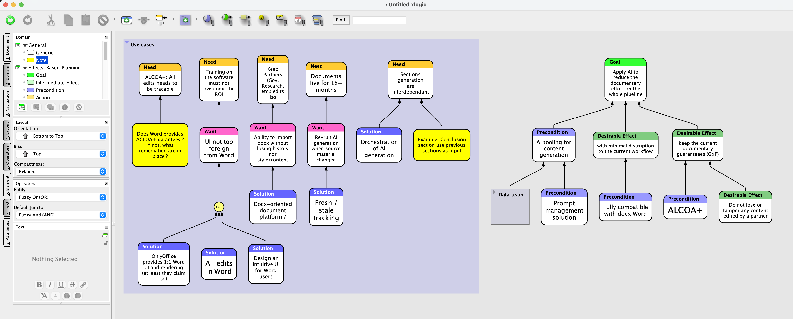

# Initial end-to-end implementation

## Statut

WIP — plan de travail, 21 juillet 2026.

Ce dossier porte la première tranche verticale réelle de Sequit. Le graphe Flying Logic « AI for documentary effort » sert de scénario fil rouge et de spécification exécutable.

## Objectif

Remplacer le graphe de démonstration codé en dur par une chaîne applicative minimale mais réelle :

```text
Document Sequit en TOML, `persistenceFormat = 1`
        ↓
Parsing, mapping et validation documentaire
        ↓
LogicDocument importé
        ↓
Adaptateur Yjs live document, `yjsLiveDocumentFormat = 1`
        ↓
LogicDocument courant relu depuis le Y.Doc
        ↓
Graphe logique validé
        ↓
Rangs topologiques et layout bottom-to-top, ELK si compatible
        ↓
Modèle de rendu
        ↓
Canvas Svelte
```

Deux formats sont versionnés dans la tranche initiale : `persistenceFormat` décrit le schéma documentaire portable encodé initialement en TOML ; `yjsLiveDocumentFormat` décrit le schéma applicatif live du `Y.Doc`. `wireFormat` nomme une troisième frontière de version future pour l’enveloppe du protocole réseau transportant les updates Yjs, mais aucun numéro, schéma ou symbole de code correspondant n’est introduit dans cette tranche.

La boucle BDD externe couvre progressivement ce parcours. Chaque tranche étend le scénario exécutable jusqu’à la prochaine frontière, puis chaque composant est développé par une boucle interne test–implémentation–refactor.

## Décisions actées

### `persistenceFormat` — document portable TOML

- Le DSL Sequit utilise TOML comme premier encodage concret du format de persistance.
- Le premier fichier est `examples/ai-documentation.sequit.toml`.
- Le document TOML porte `persistenceFormat = 1` dès son introduction.
- `smol-toml` est utilisé derrière l’adaptateur TOML ; ses erreurs sont normalisées dans les diagnostics Sequit.
- L’accès à un CST ou aux positions de chaque valeur valide est différé jusqu’à l’édition textuelle directe.
- Les natures, groupes, nœuds, junctions et relations ont des identifiants stables.
- Les identifiants des endpoints sont uniques entre groupes, nœuds et junctions.
- Les relations possèdent également leur propre identifiant stable.
- Le contenu des boîtes est du Markdown dans des chaînes littérales TOML multilignes `'''...'''`.
- La valeur Markdown obtenue après décodage TOML est conservée exactement par le mapping : aucun `trim`, ajout ou normalisation n’est appliqué aux formats.
- Le texte du scénario de référence conserve fidèlement les fautes de la capture ; toute correction future est une transformation explicite, pas une transcription silencieuse.
- L’ordre des tables TOML n’a aucune sémantique. Le mapping normalise les collections par identifiant stable ; l’ordre logique vient des relations et l’ordre visuel du layout.
- La tranche initiale implémente la lecture du `persistenceFormat`. Son serializer canonique est une capacité de persistance requise pour la suite, pas une possibilité abandonnée.
- Le futur round-trip TOML garantira la sémantique, mais pas la préservation des commentaires ni du formatage source.
- Le nom `persistenceFormat` est volontairement indépendant de TOML : d’autres encodages de persistance pourront partager le modèle logique pour de très grands graphes, sans entrer dans cette tranche.

### `yjsLiveDocumentFormat` — schéma live du `Y.Doc`

- Le `yjsLiveDocumentFormat` porte sa propre version, indépendante de `persistenceFormat`.
- Cette version décrit les structures partagées applicatives live présentes dans le `Y.Doc`, qu’elles soient observées en mémoire, transportées par Yjs ou persistées plus tard sous forme d’updates.
- `importLogicDocument` initialise un `Y.Doc` depuis un document persistant ; il n’est pas utilisé comme primitive normale de modification collaborative.
- Après l’import, le graphe et le canvas dérivent toujours du `LogicDocument` courant relu depuis le `Y.Doc`.
- La lecture vérifie le `yjsLiveDocumentFormat` avant de projeter le contenu partagé vers le domaine.
- Les modifications métier concurrentes utilisent des opérations fines de l’adaptateur, jamais la réécriture concurrente du document complet.
- Le Markdown est stocké sans normalisation dans des `Y.Text`. `Y.XmlFragment` reste différé jusqu’au choix d’un éditeur rich text structuré.

### `wireFormat` — frontière future du protocole réseau

- `wireFormat` est le nom réservé conceptuellement pour la version de l’enveloppe du futur protocole de collaboration, indépendante de `persistenceFormat` et de `yjsLiveDocumentFormat`.
- Il transportera notamment des updates Yjs, mais ne désigne ni leur encodage interne géré par Yjs ni le schéma du `Y.Doc`.
- Sa version devra être négociée ou vérifiée hors du `Y.Doc`, avant l’application d’un payload incompatible.
- Aucun numéro de version, constante, type, enveloppe ou migration `wireFormat` n’est créé par cette tranche.
- Le protocole réseau, son enveloppe et cette négociation restent hors de la tranche initiale.

### Tests

- Vitest, sans Gherkin.
- Structure RSpec avec des `describe` nommant le scénario et les comportements.
- Arrange/Act/Assert ou Given/When/Then dans le corps des tests selon ce qui est le plus lisible.
- Builders valides par défaut pour les petits cas unitaires.
- Scénarios pour les documents utilisateur complets.
- Perturbateurs pour introduire un seul cas limite dans un scénario valide.
- Harnesses mockists aux ports du système, sans mocker les structures internes de Yjs.
- Les tests de l’adaptateur utilisent de vrais `Y.Doc` en mémoire.
- Aucun `it.todo` ni test désactivé : un scénario entre dans le code lorsqu’il devient exécutable dans la tranche courante.

### E2E navigateur

- Playwright est la cible pour le sommet de la pyramide.
- La stack locale Cloudflare est Wrangler + workerd/Miniflare, pas LocalStack.
- Testcontainers et l’isolation parallèle par conteneurs sont différés.
- La première tranche vise un seul scénario navigateur représentatif. La parallélisation des E2E sera traitée lorsqu’elle sera utile.

### Layout initial — candidat ELK

- `elkjs` et l’algorithme ELK layered sont le premier candidat pour fournir le moteur de layout.
- ELK reste derrière un adaptateur : ni ses types ni ses options ne sortent de la couche layout.
- L’API de layout est asynchrone dès son introduction pour rester déplaçable dans un Web Worker sans rupture de contrat.
- La version d’`elkjs` est verrouillée exactement ; les entrées sont ordonnées canoniquement par identifiant et les options, dont toute seed pertinente, sont fixées explicitement.
- Le déterminisme est garanti à version d’ELK, options, rangs, ordre canonique et mesures identiques ; une mise à jour d’ELK peut modifier la géométrie tout en conservant les invariants.
- La tranche initiale configure seulement le bottom-to-top, les rangs topologiques, les groupes, les junctions, les dimensions et le routage nécessaires au scénario.
- Les rangs sont d’abord traduits en partitions ELK avec `org.eclipse.elk.partitioning.activate` et `org.eclipse.elk.partitioning.partition`, sous `org.eclipse.elk.layered` avec une direction `UP`.
- Cette traduction est une hypothèse d’intégration à vérifier sur ELK réel : l’ordre des partitions est documenté, mais l’alignement de tous les éléments d’un même rang dans une bande unique doit être prouvé par le scénario.
- Une gate de compatibilité précède l’adoption définitive d’ELK. Si elle échoue, l’adaptateur est conservé mais ELK n’est ni forcé ni forké ; un moteur dédié minimal peut prendre sa place derrière le même contrat.
- Les réglages avancés, la stabilité incrémentale et la réduction poussée des croisements sont différés.

## Scénario de référence



Le fichier [`scenario.png`](./scenario.png) est la source visuelle de référence pour la transcription initiale. Le document TOML en capture la sémantique ; l’image ne sert ni de fixture machine ni de référence pixel-perfect pour les tests.

### Inventaire attendu

Le document de référence contient :

- 7 natures ;
- 2 groupes ;
- 24 nœuds sémantiques ;
- 1 junction XOR ;
- 20 relations.

Le texte doit d’abord être transcrit fidèlement depuis la capture Flying Logic. Les corrections orthographiques éventuelles doivent être explicites et ne pas masquer une erreur de transcription.

### Natures

- `need` — Need ;
- `want` — Want ;
- `solution` — Solution ;
- `goal` — Goal ;
- `precondition` — Precondition ;
- `desirable-effect` — Desirable Effect ;
- `note` — Note.

Chaque nature possède au minimum un libellé et une couleur.

### Groupe `use-cases`

#### Needs

- `traceable-edits` — « ALCOA+: All edits needs to be tracable » ;
- `training-roi` — « Training on the software must not overcome the ROI » ;
- `isolated-partner-edits` — « Keep Partners (Gov, ReSearch, etc.) edits iso » ;
- `documents-live-18-months` — « Documents live for 18+ months » ;
- `interdependent-sections` — « Sections generation are interdependant ».

#### Wants

- `familiar-word-ui` — « UI not too foreign from Word » ;
- `lossless-docx-import` — « Ability to import docx without losing history nor style/content » ;
- `regenerate-on-source-change` — « Re-run AI generation when source material changed ».

#### Solutions

- `ai-generation-orchestration` — « Orchestration of AI generation » ;
- `docx-oriented-platform` — « Docx-oriented document platform ? » ;
- `freshness-tracking` — « Fresh / stale tracking » ;
- `onlyoffice` — « OnlyOffice provides 1:1 Word UI and rendering (at least they claim so) » ;
- `all-edits-in-word` — « All edits in Word » ;
- `intuitive-word-ui` — « Design an intuitive UI for Word users ».

#### Notes

- `word-alcoa-question` — « Does Word provides ALCOA+ garantees ? If not, what remediation are in place ? » ;
- `conclusion-section-example` — « Example: Conclusion section use previous sections as input ».

#### Junction

- `word-ui-options` — opérateur `xor`.

#### Relations

- `word-alcoa-question` → `traceable-edits` ;
- `familiar-word-ui` → `training-roi` ;
- `lossless-docx-import` → `isolated-partner-edits` ;
- `docx-oriented-platform` → `lossless-docx-import` ;
- `regenerate-on-source-change` → `documents-live-18-months` ;
- `freshness-tracking` → `regenerate-on-source-change` ;
- `ai-generation-orchestration` → `interdependent-sections` ;
- `conclusion-section-example` → `interdependent-sections` ;
- `onlyoffice` → `word-ui-options` ;
- `all-edits-in-word` → `word-ui-options` ;
- `intuitive-word-ui` → `word-ui-options` ;
- `word-ui-options` → `familiar-word-ui`.

### Groupe `data-team`

Le groupe `data-team`, libellé « Data team », reste vide pour cette première tranche.

La capture le montre comme un groupe replié relié à `ai-content-generation`. Le format initial autorise donc explicitement un groupe à être un endpoint adressable :

```toml
[groups.data-team]
label = "Data team"

[relations.data-team-to-ai-content-generation]
from = "data-team"
to = "ai-content-generation"
```

Une relation incidente à un groupe commence ou se termine sur les bounds du groupe selon que celui-ci est sa source ou sa cible, sans désigner implicitement de membre interne. Ce contrat couvre les groupes repliés et les groupes vides. Des ports explicites ne seront introduits que lorsqu’un sous-graphe réel possédera plusieurs entrées ou sorties distinctes.

### Graphe principal

#### Goal

- `reduce-documentary-effort` — « Apply AI to reduce the documentary effort on the whole pipeline ».

#### Preconditions

- `ai-content-generation` — « AI tooling for content generation » ;
- `prompt-management` — « Prompt management solution » ;
- `docx-word-compatible` — « Fully compatible with docx Word » ;
- `alcoa-plus` — « ALCOA+ ».

#### Desirable Effects

- `minimal-workflow-disruption` — « with minimal disruption to the current workflow » ;
- `preserve-documentary-guarantees` — « keep the current documentary guarantees (GxP) » ;
- `preserve-partner-content` — « Do not lose or tamper any content edited by a partner ».

#### Relations

- `ai-content-generation` → `reduce-documentary-effort` ;
- `minimal-workflow-disruption` → `reduce-documentary-effort` ;
- `preserve-documentary-guarantees` → `reduce-documentary-effort` ;
- `data-team` → `ai-content-generation` ;
- `prompt-management` → `ai-content-generation` ;
- `docx-word-compatible` → `minimal-workflow-disruption` ;
- `alcoa-plus` → `preserve-documentary-guarantees` ;
- `preserve-partner-content` → `preserve-documentary-guarantees`.

## Forme TOML visée

Extrait indicatif, non encore contractuel :

```toml
persistenceFormat = 1

[document]
id = "ai-documentary-effort"
title = "AI for documentary effort"

[layout]
direction = "bottom-to-top"

[natures.need]
label = "Need"
color = "#f4c400"

[groups.use-cases]
label = "Use cases"

[nodes.traceable-edits]
nature = "need"
group = "use-cases"
markdown = '''
ALCOA+: All edits needs to be tracable
'''

[junctions.word-ui-options]
operator = "xor"
group = "use-cases"

[relations.word-ui-options-to-familiar-word-ui]
from = "word-ui-options"
to = "familiar-word-ui"
```

Le schéma exact est validé par le scénario de référence, pas par cet extrait documentaire.

## Contrats architecturaux à faire émerger

Les noms sont indicatifs. Ils pourront évoluer pendant les refactors, mais les responsabilités doivent rester séparées.

### Adaptateur TOML

```text
parseSequitToml(source)
    → ParseResult<LogicDocument>
```

L’adaptateur sépare parsing syntaxique, mapping et validation documentaire. Il valide la version TOML, la forme des données, les champs requis, les natures et l’unicité des identifiants. Il conserve les identifiants d’endpoints des relations sans les résoudre.

`LogicDocument` contient uniquement la sémantique du document : natures, groupes, nœuds, junctions, relations et préférences de layout. Il ne contient ni objets Yjs, ni coordonnées de rendu.

### Adaptateur Yjs

```text
importLogicDocument(ydoc, document)
readLogicDocument(ydoc)
    → YjsLiveDocumentResult<LogicDocument>
```

L’import écrit le `yjsLiveDocumentFormat` et initialise des structures partagées fines. La lecture vérifie cette version avant de projeter le `Y.Doc` vers un nouveau `LogicDocument`. Les opérations métier ajoutées pour les use cases modifient ces structures dans des transactions Yjs sans remplacer le document complet.

L’adaptateur définit le schéma Yjs et le masque au reste de l’application. Les composants Svelte ne manipulent jamais directement `Y.Map`, `Y.Array`, `Y.Text` ou `Y.XmlFragment`.

### Graphe

```text
createGraph(document)
    → GraphResult<LogicGraph>
```

Le graphe résout les identifiants d’endpoints, accepte nœuds, groupes et junctions comme endpoints, puis détecte les références inconnues et les cycles. Il ne connaît ni TOML, ni Yjs, ni Svelte.

### Rangs topologiques

```text
topologicallyRank(graph)
    → TopologicalRanks
```

Le contrat représente un ordre partiel par rangs : le rang de chaque source est strictement inférieur à celui de sa cible. Il ne retourne pas une liste qui imposerait un ordre total entre deux branches indépendantes.

Les rangs canoniques utilisent la longueur du plus long chemin depuis une source :

```text
rank(v) = 0                                      si v n’a aucun prédécesseur
rank(v) = 1 + max(rank(u) pour chaque u → v)   sinon
```

Cette récurrence est calculée après validation de l’acyclicité. Elle produit les rangs minimaux respectant toutes les relations et ne dépend ni de l’ordre des tables TOML ni de l’ordre d’itération interne. Les nœuds et junctions isolés reçoivent le rang `0`.

Un groupe purement structurel ne reçoit pas de rang du seul fait qu’il contient des membres. Un groupe reçoit un rang d’endpoint uniquement lorsqu’il participe lui-même à une relation ; ses membres restent rangés indépendamment. Dans le scénario initial, `use-cases` est seulement un conteneur tandis que `data-team` est un endpoint de rang `0`.

### Layout

```text
layoutGraph(graph, ranks, measurements, preferences)
    → Promise<LayoutResult>
```

L’adaptateur de layout traduit le graphe et ses rangs topologiques vers le moteur sélectionné par la gate de compatibilité, impose leur ordre vertical, puis reconvertit la sortie dans les types géométriques de Sequit. ELK layered est essayé en premier. L’adaptateur consomme aussi les dimensions de nœuds, junctions et libellés de groupes, puis produit leurs bounds et les routes des relations. Deux éléments de même rang ne reçoivent aucun ordre relatif métier. Le renderer consomme ces mêmes bounds ; les dimensions ne sont jamais dupliquées dans le modèle métier.

Une bande de rang désigne l’intervalle vertical englobant les bounds de tous les sommets portant ce rang, exprimés dans le repère global du layout. Pour deux rangs `r < s`, toute la bande de `s` doit être strictement au-dessus de celle de `r` ; aucun alignement exact des centres, des bords ou des hauteurs n’est requis entre éléments de même rang. Les bounds d’un groupe purement structurel sans rang, comme `use-cases`, peuvent traverser plusieurs bandes et sont exclus de cet invariant ; un groupe endpoint rangé, comme `data-team`, y participe.

### Canvas

```text
LogicDocument courant + LayoutResult
    → CanvasModel
    → composants Svelte
```

Le `LogicDocument` courant provient de `readLogicDocument`, jamais directement du résultat initial du parser. Le renderer est une projection pure : il ne parse pas TOML, ne lit pas Yjs, ne calcule pas les rangs topologiques et ne connaît pas ELK.

### Direction architecturale progressive

La tranche verticale doit faire émerger l’architecture décrite dans le document de design sans créer à l’avance des dossiers ou abstractions vides.

```text

`persistenceFormat` TOML
            │
            ▼
     Adaptateur TOML
            │
            ▼
      LogicDocument importé
            │
            ▼
Adaptateur `yjsLiveDocumentFormat` ⇄ Y.Doc
            │
            ▼
      LogicDocument courant
            │
            ▼
         LogicGraph
            │
            ▼
    rangs topologiques
            │
            ▼
     adaptateur de layout
            │
            ▼
         CanvasModel
            │
            ▼
       renderer Svelte

Transport futur :

pair ⇄ enveloppe `wireFormat` contenant des updates Yjs ⇄ Worker
```

La direction des dépendances reste orientée vers le domaine pur :

- `persistenceFormat` et `yjsLiveDocumentFormat` versionnent les deux frontières implémentées par cette tranche ; `wireFormat` identifie une frontière future distincte, pas un troisième type métier déjà matérialisé ;
- TOML est le premier encodage portable de `persistenceFormat`, le `Y.Doc` matérialise `yjsLiveDocumentFormat` et le futur protocole réseau matérialisera puis versionnera `wireFormat` ;
- `LogicGraph` dépend du `LogicDocument` courant, jamais de Yjs ou du parser TOML ;
- le layout dépend du graphe, des rangs et de mesures explicites, jamais du DOM ;
- le canvas consomme un `CanvasModel`, sans connaître le stockage, les adaptateurs, les rangs topologiques ou ELK ;
- le Worker collaboratif transportera et persistera les updates Yjs sans devenir propriétaire des règles de document, de graphe ou de layout.

Organisation cible indicative, à créer seulement lorsque chaque responsabilité possède une implémentation réelle :

```text
src/lib/
├── text/            # adaptateur TOML, mapping et diagnostics source
├── document/        # LogicDocument, commandes et éventuelle DocumentSession
├── collaboration/   # schéma et adaptateur Yjs
├── graph/           # résolution, cycles et rangs topologiques
├── layout/          # géométrie et placement purs
├── canvas/          # CanvasModel et état local du viewport
└── components/
    └── canvas/      # projection Svelte
```

Répartition de l’état visée :

- le `Y.Doc` en `yjsLiveDocumentFormat` contient les natures, groupes, nœuds, junctions, relations, contenus `Y.Text` et contraintes persistantes ;
- l’awareness contiendra plus tard présence, curseurs, sélections et gestes temporaires ;
- le viewport, le zoom, l’outil actif, le survol et les caches de géométrie restent locaux ;
- les positions produites par un layout déterministe ne sont pas synchronisées ; seules leurs éventuelles contraintes persistantes le sont.

Une façade `DocumentSession` n’est introduite que lorsque les premiers use cases montrent son API réelle. Lorsqu’elle existe, elle est l’unique point d’entrée applicatif vers Yjs. Avant cela, l’orchestrateur applicatif appelle l’adaptateur ; les composants Svelte ne manipulent jamais les structures CRDT directement.

## Stratégie de tests

### Support de scénario

Créer uniquement les helpers utilisés par la tranche en cours :

```text
tests/
├── scenarios/
│   └── ai-documentary-effort.ts
├── builders/
├── perturbators/
└── harnesses/
```

Le scénario `aiDocumentaryEffortScenario()` charge comme source le vrai fichier `examples/ai-documentation.sequit.toml`. Il ne duplique ni le TOML ni sa structure sémantique dans une constante TypeScript.

Une configuration Vitest applicative distincte du pool Cloudflare couvre document, Yjs en mémoire, graphe, layout et orchestration. Les scripts séparent au minimum `test:web`, `test:collaboration` et `test:e2e` ; le script `test` agrège les suites Vitest qui doivent rester vertes ensemble.

### Boucle externe

Un test d’acceptation Vitest traverse à chaque tranche toutes les frontières applicatives déjà disponibles. Ses assertions progressent du parsing vers Yjs, le graphe, le layout puis le `CanvasModel`, sans test désactivé ni faux adaptateur. Playwright reprend le même scénario lorsqu’un navigateur peut enfin traverser la chaîne complète.

Forme finale visée :

```ts
describe('AI for documentary effort', () => {
  describe('when the document is opened', () => {
    it('renders its complete dependency graph', async () => {
      // Arrange: real example document and application harness
      // Act: open the document through the application use case
      // Assert: semantic entities and layout invariants
    });
  });
});
```

Le test n’utilise pas un snapshot de pixels et ne fixe pas l’ordre horizontal de branches indépendantes. À chaque étape, il affirme seulement les résultats observables de la frontière atteinte.

### Boucles internes

#### Parsing et document

- charge le scénario complet ;
- rejette une syntaxe TOML invalide avec un diagnostic Sequit normalisé ;
- rejette un `persistenceFormat` inconnu ;
- rejette une forme ou un champ requis invalide avec un diagnostic normalisé ;
- rejette un identifiant dupliqué entre endpoints ;
- rejette une nature inconnue ;
- expose des diagnostics par chemin logique TOML ;
- conserve exactement la valeur Markdown décodée par TOML, nouvelle ligne finale comprise, sans normalisation ;
- produit le même `LogicDocument` lorsque seules les tables TOML sont réordonnées.

#### Adaptateur Yjs

- importe puis relit le scénario sans perte sémantique ;
- écrit et vérifie un `yjsLiveDocumentFormat` indépendant de `persistenceFormat` ;
- rejette un `yjsLiveDocumentFormat` inconnu ;
- conserve tous les identifiants stables ;
- stocke chaque Markdown dans un `Y.Text` sans le normaliser ;
- préserve exactement le Markdown à travers `LogicDocument → Y.Text → LogicDocument` ;
- fait converger deux vrais `Y.Doc` après deux opérations métier indépendantes appliquées par l’adaptateur ;
- prouve que cette convergence n’utilise pas deux réécritures concurrentes du document complet ;
- garde la couche Yjs hors du modèle métier.

#### Graphe

- résout les 20 relations ;
- rejette une référence d’endpoint inconnue ;
- représente la junction XOR avec trois entrées et une sortie, sans lui attribuer de sémantique d’évaluation ;
- accepte le groupe vide adressable `data-team` ;
- conserve le groupe comme endpoint explicite sans résoudre de membre interne ;
- détecte un cycle introduit par `withCycle(...)` ;
- retourne le cycle complet dans le diagnostic.

#### Rangs topologiques

- chaque sommet sans prédécesseur reçoit le rang `0` ;
- chaque autre sommet reçoit `1 + max(rang de ses prédécesseurs)` ;
- deux branches soumises aux mêmes contraintes peuvent partager un rang sans recevoir d’ordre relatif ;
- `use-cases` ne reçoit pas de rang en tant que simple conteneur, tandis que `data-team` reçoit son rang d’endpoint ;
- la sortie est déterministe à graphe sémantiquement identique ;
- réordonner les tables TOML ne change pas les rangs.

#### Layout

- reçoit explicitement les rangs topologiques calculés par le domaine ;
- impose un ordre visuel bottom-to-top compatible avec ces rangs ;
- ne donne aucun ordre relatif métier à deux éléments de même rang ;
- place les éléments d’un même rang dans une même bande visuelle sans leur imposer d’ordre horizontal métier ;
- prouve cette propriété avec au moins trois rangs, plusieurs éléments indépendants sur un même rang, le groupe composé `use-cases` et le groupe vide endpoint `data-team` ;
- les nœuds ne se chevauchent pas ;
- les membres de `use-cases` restent dans les bounds du groupe ;
- `data-team` possède des bounds malgré son contenu vide ;
- chaque relation commence et termine sur les bounds de ses endpoints ;
- la relation depuis `data-team` commence précisément sur les bounds du groupe ;
- deux exécutions du moteur sélectionné produisent le même résultat à version, options, rangs, ordre canonique et mesures identiques ;
- réordonner les tables TOML ne change pas le layout.

#### Navigateur

- ouvre le scénario réel ;
- affiche les groupes, nœuds et junctions attendus ;
- vérifie quelques relations représentatives par leurs endpoints ;
- vérifie les invariants géométriques dans le DOM/SVG ;
- n’utilise pas de comparaison de capture pixel-perfect.

## Découpage d’implémentation

### Cadence double-loop BDD

Chaque tranche suit la même cadence :

1. étendre le scénario externe avec le prochain comportement observable ;
2. laisser ce scénario guider la frontière à implémenter ;
3. entrer dans une boucle interne avec un test TypeScript ciblé et rouge ;
4. écrire l’implémentation minimale qui rend ce test vert ;
5. rejouer le scénario externe et les tests des couches déjà traversées ;
6. effectuer immédiatement le refactor prévu pour clarifier les responsabilités révélées par le code ;
7. rejouer tests, checks et build après le refactor ;
8. supprimer le code de démonstration, les duplications et les abstractions remplacées.

La tranche suivante ne commence que lorsque la tranche courante est verte et que son refactor est terminé. Les sections `Refactor 1` à `Refactor 6` sont donc des étapes de sécurité obligatoires, pas une phase de nettoyage repoussée à la fin.

### Protocole d’exécution `/goal`

Le plan est exécuté linéairement par un propriétaire d’implémentation unique. Les couches dépendent les unes des autres ; elles ne sont donc pas réparties entre plusieurs agents écrivains en parallèle. Des revues ponctuelles en lecture seule sont possibles, mais le propriétaire principal reste seul responsable des contrats transverses et des modifications.

L’exécution est autonome du début à la fin :

- une frontière de tranche n’est pas un point de livraison ni une demande de confirmation ;
- le propriétaire poursuit automatiquement avec la tranche suivante lorsque la gate courante est fermée ;
- aucune abstraction, aucun dossier vide et aucune implémentation de la tranche suivante ne sont préparés en avance ;
- une gate n’est fermée qu’après le refactor associé, la suppression du code remplacé et l’observation des preuves requises ;
- un échec de test, check, build ou smoke test bloque la progression et doit être corrigé à sa source avant de continuer ;
- le `/goal` ne se termine qu’après satisfaction de la Definition of Done complète.

#### Gate commune à chaque tranche

Avant de passer à la tranche suivante, toutes les preuves suivantes sont requises :

1. le scénario d’acceptation externe est vert jusqu’à la frontière nouvellement disponible ;
2. les tests ciblés de la tranche et toutes les suites déjà traversées sont verts ;
3. le critère de sortie de la tranche est observé, pas seulement déduit de la compilation ;
4. le refactor associé, lorsqu’il existe, est terminé et les anciennes données, conversions ou abstractions remplacées sont supprimées ;
5. `pnpm check` et les builds concernés passent ;
6. lorsque la tranche produit un comportement exécutable, ce comportement est exercé directement par un smoke test.

#### Preuves spécifiques par gate

| Gate | Preuve supplémentaire obligatoire |
| --- | --- |
| Après la tranche 1 | Le fichier réel traverse parsing syntaxique, mapping et validation ; le `LogicDocument` complet et les diagnostics structurés sont observés ; le domaine ne dépend pas de `smol-toml`. |
| Après la tranche 2 | Le `yjsLiveDocumentFormat = 1` est relu depuis de vrais `Y.Doc`, le Markdown est préservé exactement et deux modifications métier indépendantes convergent sans réécriture concurrente du document complet. |
| Après la tranche 3 | Les références inconnues et le cycle perturbé échouent comme prévu ; les 20 relations et les rangs canoniques du scénario sont validés indépendamment de l’ordre des tables. |
| Après la tranche 4 | La gate isolée qualifie ou écarte ELK sur les rangs et groupes du scénario ; le moteur retenu traite ensuite le scénario complet et satisfait les invariants de bounds, de bandes de rang, de groupes, de routage et de déterminisme qualifié. |
| Après la tranche 5 | L’application est lancée et conduite dans un navigateur réel ; mesure, fontes, layout, groupes, junction et relations SVG sont inspectés sans donnée de graphe codée en dur. |
| Après la tranche 6 | Le scénario Playwright passe dans la stack locale réelle, le refactor final est terminé, puis `pnpm check`, toutes les suites et tous les builds passent ensemble. |

La preuve de tranche 4 commence par une gate de compatibilité ELK isolée. Elle configure `org.eclipse.elk.layered`, `UP`, le partitionnement par rang et la gestion hiérarchique, puis exerce d’abord trois rangs minimaux avant le scénario complet. ELK n’est retenu que si les rangs restent dans des bandes distinctes et ordonnées, si les éléments de même rang partagent leur bande, et si `use-cases` ainsi que `data-team` conservent les comportements attendus.

### Tranche 1 — TOML, `LogicDocument` et validation

- créer `examples/ai-documentation.sequit.toml` avec `persistenceFormat = 1` ;
- transcrire fidèlement depuis [`scenario.png`](./scenario.png) les 7 natures, 2 groupes, 24 nœuds, 1 junction et 20 relations, fautes comprises ;
- utiliser des tables `[relations.<id>]` cohérentes avec le vocabulaire métier ;
- ajouter `smol-toml` derrière un adaptateur syntaxique ;
- valider explicitement la syntaxe TOML et normaliser ses erreurs ;
- introduire le modèle `LogicDocument`, le mapping et la validation documentaire ;
- ajouter les diagnostics par chemin, puis valider champs requis, natures et identifiants ;
- ajouter le chargeur de scénario TypeScript et les premiers perturbateurs sémantiques ;
- introduire la configuration Vitest applicative et les scripts `test:web` et `test:collaboration` distincts ;
- écrire le premier test externe `source TOML → LogicDocument` et les tests ciblés du parsing, du mapping et de la validation.

Critère de sortie : le fichier réel traverse le parsing syntaxique, le mapping et la validation pour produire un `LogicDocument` complet ; les erreurs syntaxiques et documentaires ciblées sont structurées et testées ; les deux suites Vitest sont exécutables séparément.

### Refactor 1

- séparer clairement parsing syntaxique, mapping et validation documentaire ;
- supprimer toute duplication du document entre TOML et TypeScript ;
- stabiliser les noms du scénario et des identifiants ;
- éliminer toute dépendance à `smol-toml` du modèle logique ;
- réduire les conversions et allocations inutiles ;
- ne conserver que les helpers de test réellement utilisés.

### Tranche 2 — `yjsLiveDocumentFormat`

- définir `yjsLiveDocumentFormat = 1` indépendamment de `persistenceFormat` ;
- importer le `LogicDocument`, puis relire le document courant utilisé par la suite de la chaîne ;
- représenter le Markdown sans normalisation par des `Y.Text` et les entités par des structures partagées fines ;
- utiliser de vrais `Y.Doc` dans les tests ;
- introduire les opérations minimales de l’adaptateur nécessaires au scénario de convergence ;
- faire converger deux modifications indépendantes sans réécriture concurrente du document complet ;
- ne pas intégrer encore `wireFormat`, le protocole réseau ni la persistance Durable Object.

Critère de sortie : le round-trip `yjsLiveDocumentFormat` est sémantiquement identique, le Markdown est strictement préservé, un `yjsLiveDocumentFormat` inconnu est rejeté et deux documents convergent après des modifications métier indépendantes.

### Refactor 2

- placer tout accès Yjs derrière l’adaptateur ;
- introduire une façade `DocumentSession` uniquement si les use cases en ont besoin ;
- supprimer les types Yjs des signatures métier.

### Tranche 3 — Graphe et rangs topologiques

- construire le graphe depuis le `LogicDocument` courant relu depuis Yjs ;
- résoudre nœuds, groupes et junctions ;
- détecter les références inconnues et cycles ;
- introduire `withCycle(...)` ;
- calculer les rangs canoniques par plus long chemin sans produire d’ordre total arbitraire ;
- distinguer les groupes purement structurels des groupes qui participent comme endpoints ;
- vérifier que l’ordre des tables TOML n’influence ni le graphe ni les rangs.

Critère de sortie : les 20 relations sont résolues, le scénario est acyclique, chaque sommet suit la récurrence canonique des rangs, `use-cases` reste un conteneur sans rang propre, `data-team` possède son rang d’endpoint et le perturbateur de cycle produit le diagnostic attendu.

### Refactor 3

- séparer document sémantique, graphe validé et rangs topologiques ;
- garder le graphe indépendant de Yjs et du renderer ;
- vérifier que les diagnostics restent au bon niveau d’abstraction.

### Tranche 4 — Layout pur, candidat ELK

- ajouter une version exacte d’`elkjs` derrière un adaptateur de layout ;
- définir les dimensions d’entrée ;
- recevoir explicitement les rangs avec le graphe et les mesures ;
- traduire nœuds, junctions, groupes, relations et contraintes de rang vers ELK layered ;
- ordonner canoniquement toutes les entrées et fixer les options ELK ainsi que toute seed pertinente ;
- commencer par la gate de compatibilité sur le vrai `elkjs` : trois rangs, plusieurs éléments de même rang, `use-cases`, `data-team` et relations incidentes ;
- configurer `org.eclipse.elk.layered`, `elk.direction = UP`, `org.eclipse.elk.partitioning.activate = true`, une partition par rang et la gestion hiérarchique nécessaire ;
- vérifier avant de poursuivre que les partitions préservent les bandes de rang, pas seulement leur ordre global ;
- si cette gate échoue, conserver `layoutGraph(...)` et ses tests, écarter ELK sans le forker, puis implémenter le moteur dédié minimal derrière l’adaptateur ;
- produire des bounds de nœuds, junctions et groupes ;
- supporter bottom-to-top sans contredire les rangs ;
- reconvertir les routes du moteur sélectionné dans `LayoutResult` ;
- défendre les invariants plutôt que des coordonnées exactes ;
- exposer dès maintenant une API asynchrone.

Critère de sortie : la gate de compatibilité a sélectionné ELK ou le moteur dédié minimal ; le scénario complet obtient un layout conforme aux rangs, sans chevauchement et conforme aux relations et groupes ; à moteur et version, options, rangs, ordre canonique et mesures identiques, deux exécutions produisent le même résultat.

### Refactor 4

- séparer `GraphNode`, les rangs, l’entrée du moteur sélectionné, `LayoutNode` et `RenderedNode` ;
- empêcher les types et options du moteur sélectionné de sortir de l’adaptateur ;
- conserver le contrat asynchrone qui permettra un déplacement ultérieur dans un Web Worker ;
- centraliser toute la géométrie consommée par les boîtes et relations.

### Tranche 5 — Canvas alimenté par le scénario

- supprimer `preview-graph.ts` ;
- introduire `openDocument(source)` comme use case d’orchestration du parsing, de l’import Yjs, de la relecture et des projections ;
- alimenter le canvas avec le résultat de la chaîne réelle ;
- rendre les natures, groupes, junctions et relations ;
- conserver le renderer DOM + SVG ;
- effectuer un premier rendu de mesure hors layout, attendre les fontes nécessaires, puis calculer le layout et rendre les éléments positionnés ;
- recalculer à travers la même frontière explicite lorsqu’une dimension observée change ;
- autoriser une normalisation d’espaces strictement locale à la présentation, sans modifier le Markdown du domaine ni du `Y.Text`.

Critère de sortie : l’application affiche le document TOML de référence après passage effectif par `yjsLiveDocumentFormat`, sans données de graphe codées en dur dans les composants et sans mutation du Markdown stocké.

### Refactor 5

- rendre les composants de canvas purs par rapport à TOML et Yjs ;
- supprimer les dépendances circulaires ou conversions redondantes apparues pendant la tranche verticale ;
- revoir les noms des ports applicatifs à partir de leurs usages réels.

### Tranche 6 — Premier E2E navigateur

- ajouter Playwright et le script `test:e2e` ;
- démarrer la stack locale existante avec le harness E2E ;
- exposer une route d’exemple dédiée qui charge le fichier de référence et délègue au même `openDocument(source)` que l’application ;
- ouvrir le scénario de référence ;
- vérifier les éléments sémantiques et les invariants de connexion ;
- conserver un seul test principal tant que l’isolation parallèle n’est pas nécessaire.

Critère de sortie : un navigateur réel prouve que le document en `persistenceFormat` traverse `yjsLiveDocumentFormat` et toute la chaîne jusqu’au canvas.

### Refactor 6

- supprimer tout branchement applicatif introduit uniquement pour le test ;
- vérifier que la route d’exemple délègue réellement au même `openDocument(source)` ;
- réduire le harness Playwright et ses sélecteurs au contrat utilisateur nécessaire ;
- supprimer les données, conversions et abstractions remplacées pendant la dernière tranche ;
- rejouer l’E2E, toutes les suites, `pnpm check` et les builds.

## Scénarios préservés pour les tranches suivantes

Ces comportements restent dans le plan jusqu’à ce que leur frontière existe. Ils ne sont pas ajoutés comme tests désactivés.

### Sérialisation canonique du `persistenceFormat`

- cette capacité est requise après la tranche initiale afin de persister les modifications, même si elle n’est pas implémentée dans ce plan ;
- `LogicDocument → serializer → parser` conserve le même document sémantique ;
- la sérialisation est déterministe ;
- les tables ne tirent aucune sémantique de leur ordre ;
- TOML est le premier encodage, mais d’autres adaptateurs de persistance adaptés à de très grands graphes pourront rejoindre la même frontière plus tard.

### Collaboration réseau

- les pairs négocient un `wireFormat` compatible hors du `Y.Doc` avant d’appliquer les updates Yjs transportées ;
- deux navigateurs ouvrent le même document ;
- chaque navigateur effectue une modification indépendante ;
- les deux `Y.Doc` convergent via le Durable Object ;
- le document survit à la reconstruction du Durable Object ;
- l’awareness n’est pas persistée.

### Rich text

- le Markdown du DSL devient un document rich text ;
- l’édition concurrente conserve le contenu des deux participants ;
- le layout est recalculé après un changement de dimensions.

### Layout avancé

- plusieurs branches indépendantes restent stables ;
- les croisements sont réduits ;
- les contraintes manuelles persistent sans synchroniser les coordonnées dérivées ;
- le calcul peut être déplacé dans un Web Worker.

### Texte comme interface directe

- édition textuelle et canvas modifient le même document structuré ;
- diagnostics avec ligne et colonne ;
- décision explicite sur la préservation des commentaires et du formatage TOML.

## Hors périmètre initial

- implémentation complète du protocole Yjs sur le Durable Object ;
- snapshots, compaction et restauration réseau ;
- awareness, curseurs et sélections distantes ;
- authentification et permissions ;
- éditeur rich text ;
- éditeur TOML intégré ;
- sérialisation lossless des commentaires TOML ;
- Web Worker de layout ;
- algorithme avancé de réduction des croisements ;
- drag, pan et zoom fonctionnels ;
- Testcontainers ;
- exécution parallèle des E2E ;
- comparaison visuelle pixel-perfect.

## Stratégie future d’isolation E2E

Lorsque plusieurs E2E devront tourner en parallèle, essayer d’abord l’isolation native avant Docker :

- ports uniques par worker Playwright ;
- répertoire Miniflare distinct par worker ;
- identifiants de documents uniques ;
- reset explicite de l’état local ;
- éventuellement `--persist-to .wrangler/e2e/<worker-id>`.

Testcontainers ne sera introduit que si des services externes réellement conteneurisables rejoignent la stack ou si l’isolation par processus devient insuffisante.

## Definition of Done de la tranche initiale

- `examples/ai-documentation.sequit.toml` décrit fidèlement le graphe de référence dans `persistenceFormat = 1` ;
- aucune donnée sémantique de ce graphe n’est dupliquée dans le frontend ;
- `persistenceFormat` et `yjsLiveDocumentFormat` possèdent des responsabilités et des versions indépendantes ;
- la tranche implémente `persistenceFormat` en lecture et `yjsLiveDocumentFormat = 1` dans le `Y.Doc` ; `wireFormat` reste une frontière future nommée mais sans version ni artefact de code dans cette tranche ;
- le Markdown décodé traverse `LogicDocument`, `Y.Text` et `LogicDocument` sans normalisation ;
- le document traverse parsing, mapping, validation, `LogicDocument` importé, Yjs live document, `LogicDocument` courant, graphe, rangs topologiques et moteur de layout sélectionné ;
- les rangs topologiques canoniques sont une entrée obligatoire du layout ;
- les invariants du scénario sont testés avec Vitest à chaque frontière disponible ;
- l’ordre des tables TOML n’influence ni le document logique, ni les rangs, ni le layout ;
- au moins un perturbateur de cycle est couvert ;
- le canvas rend le résultat de la chaîne réelle après une frontière de mesure explicite ;
- un E2E Playwright vérifie le scénario dans un navigateur réel via le use case d’ouverture ;
- les tests n’imposent ni pixel snapshot ni ordre arbitraire des branches indépendantes ;
- `pnpm check`, les tests et les builds passent ;
- les refactors intermédiaires et final ont supprimé les données et abstractions devenues obsolètes.

## Questions tranchées pour cette tranche

1. `smol-toml` parse l’encodage TOML de `persistenceFormat` derrière un adaptateur ; un CST source-mappé reste différé.
2. Le document de référence conserve fidèlement les fautes de la capture, dont « ReSearch ».
3. Le `XOR` est préservé comme opérateur et rendu comme junction, sans sémantique d’évaluation.
4. Un groupe replié est un endpoint explicite ; une relation commence ou termine sur ses bounds selon son sens, sans membre interne implicite.
5. Le Markdown utilise `Y.Text` dans `yjsLiveDocumentFormat` et reste strictement inchangé aux frontières de format ; une normalisation éventuelle est limitée à la présentation.
6. Une route d’exemple dédiée sélectionne la ressource, puis appelle le même `openDocument(source)` que le reste de l’application.
7. `persistenceFormat` et `yjsLiveDocumentFormat` sont versionnés indépendamment ; `wireFormat` nomme la frontière du futur protocole réseau mais n’est ni versionné ni matérialisé dans cette tranche.
