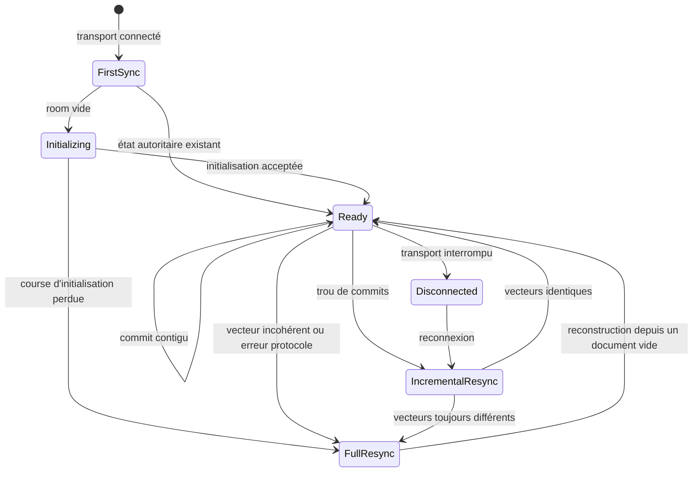

# Sequit — document de conception

## Statut

Document de travail. Il décrit l'intention fonctionnelle du produit et les décisions prises au fil des itérations.

## Vision

Sequit est un éditeur visuel collaboratif de graphes logiques, utilisable entièrement dans le navigateur.

L'expérience principale tient dans une page unique composée d'un canvas infini. Les utilisateurs y créent des boîtes typées, éditent leur contenu, les relient et laissent le système organiser automatiquement le graphe.

Le produit reprend :

- la manipulation directe et la collaboration d'un outil comme Excalidraw ;
- la structuration logique et le réagencement automatique de Flying Logic ;
- la portabilité d'une représentation textuelle déclarative comme Mermaid ou les formats de Wardley Maps.

Le canvas n'est pas la source de vérité. Il est une projection interactive d'un document logique sérialisable sous forme textuelle.

## Principes de conception

1. **La logique avant la géométrie.** Le document décrit d'abord des éléments et leurs relations, pas des formes positionnées à des coordonnées arbitraires.
2. **Une seule source de vérité.** Le canvas et l'éditeur textuel modifient le même document structuré.
3. **Manipulation visuelle en premier.** La syntaxe textuelle ne doit pas être un prérequis pour utiliser le produit.
4. **Texte lisible et portable.** Le document doit pouvoir être copié, versionné, généré et compris sans le canvas.
5. **Organisation déterministe.** Un même graphe et les mêmes options doivent produire le même agencement.
6. **Identités stables.** Renommer ou réécrire une boîte ne doit pas casser ses relations.
7. **Collaboration native.** Les boîtes, les relations et leur contenu sont des objets collaboratifs, pas un blob textuel synchronisé en bloc.

## Modèle conceptuel

### Document

Un document contient :

- une bibliothèque de natures ;
- des boîtes ;
- des relations orientées entre les boîtes ;
- des options de présentation ;
- éventuellement des contraintes légères de placement.

### Nature de boîte

Une nature définit au minimum :

- un identifiant stable ;
- un libellé, par exemple `Goal`, `Precondition`, `Action` ou `Want` ;
- une couleur constante dans le document.

Extensions possibles, encore non décidées :

- une icône ;
- une description ;
- des règles sur les relations autorisées ;
- un style visuel complémentaire.

### Boîte

Une boîte possède :

- un identifiant stable ;
- une nature ;
- un contenu rich text ;
- éventuellement des métadonnées.

Le titre visible correspond à la nature de la boîte. La couleur du titre est déterminée par cette nature.

### Relation

Une relation est orientée et relie une boîte source à une boîte cible.

Le modèle visuel pourra ressembler à un arbre, mais le modèle logique visé est un graphe orienté acyclique (DAG). Cela autorise notamment plusieurs antécédents pour une même boîte et la convergence de plusieurs branches.

La signification exacte d'une relation reste à définir : dépendance, contribution, prérequis, production, ou relation générique orientée.

## Représentation textuelle

La représentation textuelle est la forme lisible et portable du document. Le premier encodage concret est TOML sous `persistenceFormat = 1`.

```text
TOML versionné
      ↓ parsing, mapping et validation
LogicDocument sémantique
      ↓ DocumentSession / Yjs
LogicDocument courant
      ↓ graphe, rangs et layout
Canvas interactif
```

`persistenceFormat` appartient à la frontière textuelle. `LogicDocument` ne porte ni l’encodage ni sa version : un futur encodage compatible pourra produire le même modèle sémantique.

Le document contient des identifiants stables, une bibliothèque locale de natures, des groupes, des nœuds, des junctions, des relations et des préférences de layout. Le contenu des nœuds est conservé exactement sous forme de Markdown décodé ; sa présentation visuelle reste une question distincte.

## Source de vérité et édition

Le système doit éviter deux états indépendants — un fichier texte et un canvas — qu'il faudrait réconcilier.

Le modèle cible comporte trois représentations du même document :

1. **Un modèle structuré collaboratif**, manipulé par l'application.
2. **Une sérialisation textuelle stable**, destinée à la lecture, l'import, l'export et éventuellement l'édition directe.
3. **Une projection visuelle**, calculée depuis le modèle structuré.

La `DocumentSession` conserve le `Y.Doc`, applique les opérations métier fines et notifie les projections après chaque update. Le canvas relit alors le document courant au lieu de conserver le résultat initial du parser.

Une action sur le canvas modifie le document structuré :

- créer une boîte ajoute un nœud ;
- relier deux boîtes ajoute une relation ;
- changer une nature modifie le type du nœud ;
- éditer le contenu modifie son rich text ;
- supprimer une boîte supprime le nœud et traite ses relations associées.

L'éditeur textuel, s'il est exposé, doit modifier ce même document structuré après parsing et validation.

## Organisation du graphe

Le tri topologique détermine l'ordre logique des boîtes, mais pas à lui seul leurs coordonnées.

Le placement visuel nécessite un moteur de layout qui décide notamment :

- l'orientation générale, par exemple gauche vers droite ou haut vers bas ;
- les rangs des boîtes ;
- l'ordre des branches indépendantes ;
- l'espacement ;
- le routage des relations ;
- la réduction des croisements.

### Cycles

Un cycle empêche le tri topologique. La première hypothèse est donc de les interdire et de signaler immédiatement la relation qui créerait un cycle.

Ce choix reste à confirmer selon la sémantique retenue pour les relations.

### Placement manuel

Les coordonnées absolues ne devraient pas polluer la représentation logique principale.

Options à évaluer :

- layout entièrement automatique ;
- déplacement manuel temporaire, perdu au prochain réagencement ;
- contraintes déclaratives légères comme `near`, `group` ou `rank` ;
- positions persistantes conservées dans une couche de présentation séparée.

## Expérience utilisateur principale

Le parcours nominal est :

1. créer une boîte ;
2. choisir sa nature ;
3. rédiger son contenu ;
4. la relier à d'autres boîtes ;
5. observer le graphe se réorganiser ;
6. partager le document avec d'autres participants.

Fonctions centrales envisagées :

- canvas infini ;
- création et connexion rapides ;
- édition rich text dans les boîtes ;
- sélection simple et multiple ;
- zoom et déplacement du viewport ;
- auto-layout ;
- collaboration en temps réel ;
- présence, curseurs et sélections des participants ;
- undo/redo ;
- partage par URL ;
- import et export textuels.

## Collaboration

La collaboration doit porter sur des objets structurés :

- bibliothèque de natures ;
- boîtes ;
- contenu rich text ;
- relations ;
- options ou contraintes de présentation.

Yjs est le moteur CRDT. `yjsLiveDocumentFormat = 2` versionne les structures partagées indépendamment du format de persistance. La `DocumentSession` masque Yjs au reste de l’application ; le Markdown est stocké sans normalisation dans des `Y.Text`.

Le format textuel reste la représentation canonique portable. Le document complet n’est jamais resynchronisé comme une chaîne ou réimporté concurremment : les modifications collaboratives passent par des opérations fines.

### Protocole d'autorisation

Le protocole binaire de collaboration, actuellement en version `1`, distingue explicitement les demandes et réponses de synchronisation, les propositions d'initialisation ou de changement, les acceptations, les refus et les erreurs de protocole. Les mises à jour et vecteurs d'état Yjs restent binaires. Chaque proposition porte un identifiant stable qui corrèle sa décision et rend sa retransmission idempotente.

Le Durable Object est l'autorité d'une room. Il évalue chaque proposition dans un `Y.Doc` candidat jetable, sans modifier l'état accepté, selon trois étapes ordonnées :

1. lecture et validation structurelle du document Yjs, puis validation du domaine ;
2. construction du graphe, résolution des relations et rejet des cycles ;
3. exécution ordonnée des gardes de transition sur des projections immuables.

Un refus ne modifie ni l'état autoritaire, ni son numéro de commit, et n'est envoyé qu'au proposant. Une acceptation est persistée avant d'être diffusée à tous les participants, proposant compris. Les commits sont strictement croissants dans une room. Les 128 identifiants de propositions acceptées les plus récents sont conservés afin qu'une retransmission soit acquittée avec son commit d'origine sans être appliquée une seconde fois.

### État navigateur et convergence

La `CollaborativeDocumentSession` conserve deux documents privés. Le document **accepté** ne reçoit que les commits autoritaires. L'**overlay** optimiste est reconstruit depuis cet état en rejouant une file d'intentions métier. Une seule intention est en vol ; des remplacements Markdown consécutifs visant le même nœud sont coalescés. Un refus retire l'intention concernée et reconstruit l'overlay, sans tenter d'annuler une mise à jour CRDT.



Une synchronisation initiale utilise le vecteur d'un document vide : l'import local ne peut donc jamais se mélanger à une room déjà initialisée. Un trou de commits déclenche une synchronisation incrémentale depuis le vecteur accepté. Une divergence de vecteur, une course d'initialisation perdue ou une erreur binaire de protocole déclenche une reconstruction complète dans un nouveau `Y.Doc`, car une mise à jour Yjs ne peut pas retirer un historique local étranger.

### Persistance et canaux d'erreur

Le premier client initialise une room vide ; l'initialisation est `first-writer-wins` et l'identifiant du document doit correspondre au nom de la room. Le Durable Object persiste un update complet et le numéro de commit, découpés en blocs de 64 Kio dans une transaction atomique. La limite est de 15 blocs, soit 960 Kio, afin que l'update et son enveloppe restent strictement sous la limite WebSocket de 1 Mio.

Deux canaux d'erreur restent volontairement distincts. Le canal de contrôle texte répond en JSON aux clients non protocolaires et n'influence pas la session. Une frame binaire `protocol-error` signale à la session que sa convergence n'est plus prouvée et déclenche une resynchronisation complète.

Vocabulaire : une **proposition** est une transition candidate corrélée ; un **commit** est une transition autoritaire ordonnée ; l'état **autoritaire** côté room et l'état **accepté** côté navigateur désignent le même historique validé ; un **candidat** est un clone jetable évalué par l'autorité ; l'**overlay** est la projection optimiste locale ; une **décision** est l'acceptation, le refus ou l'abandon local d'une opération devenue obsolète.

## Architecture technique retenue

- frontend en SvelteKit et TypeScript ;
- déploiement sur Cloudflare ;
- Tailwind CSS pour l'interface, complété par des variables CSS pour les couleurs configurables des natures ;
- Worker Cloudflare en TypeScript pour l'entrée HTTP, l'authentification future et le routage ;
- un Durable Object par document pour coordonner les connexions WebSocket et la synchronisation Yjs.

Les mises à jour Yjs acceptées sont compactées en un état complet, découpé et persisté atomiquement par room.

## Hors périmètre à ce stade

Aucune décision n'est encore prise concernant :

- les comptes et permissions ;
- les commentaires ;
- les pièces jointes ;
- les modèles de documents ;
- les règles métier avancées ;
- l'exécution ou la simulation du graphe ;
- les formats d'export visuel ;
- le mode hors ligne.

## Questions ouvertes

1. Quelle est la sémantique précise d'une relation orientée ?
2. Les champs inconnus du format persistant doivent-ils être rejetés ou tolérés pour la compatibilité ascendante ?
3. Les natures imposent-elles des règles de connexion ou seulement une apparence ?
4. La bibliothèque de natures appartient-elle au document, à un espace de travail, ou aux deux ?
5. Le Markdown doit-il rester du texte brut dans le canvas initial ou être rendu par un sous-ensemble assaini ?
6. L'éditeur textuel est-il une interface principale, une vue secondaire, ou seulement un format d'import/export ?
7. Le layout se déclenche-t-il continuellement, à la demande, ou selon un mode choisi ?
8. Quels ajustements manuels doivent survivre à un nouvel auto-layout ?
9. Plusieurs types de relations sont-ils nécessaires ?
10. Comment le document textuel représente-t-il les métadonnées de présentation sans devenir illisible ?

## Décisions enregistrées

- Le produit est une application browser-only sur une page unique.
- L'interface principale est un canvas collaboratif.
- Les éléments sont des boîtes typées avec contenu rich text.
- Chaque nature possède un libellé et une couleur stable.
- Les boîtes sont reliées par des relations orientées.
- Un tri topologique participe à leur réorganisation automatique.
- Le canvas est dérivé d'une représentation logique sérialisable sous forme textuelle.
- TOML est le premier encodage concret, sous `persistenceFormat = 1`.
- `LogicDocument` reste indépendant de la version et de l’encodage persistants.
- `yjsLiveDocumentFormat = 2` versionne le schéma partagé indépendamment de `persistenceFormat`.
- `DocumentSession` est l’unique façade applicative vers le document Yjs live.
- Les cycles sont rejetés avant le calcul des rangs.
- Un groupe non vide occupe l’intervalle des rangs de son contenu ; un groupe vide endpoint est atomique.
- ELK a été écarté après sa gate de compatibilité ; `layoutGraph(...)` utilise un moteur dédié déterministe.
- Le frontend utilise SvelteKit et TypeScript.
- L'application est déployée sur Cloudflare.
- La collaboration passe par un Worker TypeScript et un Durable Object par document.
- Tailwind CSS habille l'interface ; les couleurs configurables des natures restent des données du document exposées par variables CSS.
