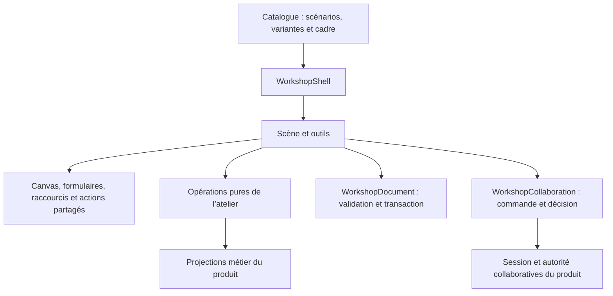

# Revue critique de l’atelier UI

L’atelier fournit un support concret pour comparer les interactions du produit. La première version avait toutefois des faiblesses de comportement et des responsabilités trop mêlées pour servir de référence d’implémentation. Les fondations communes sont corrigées. L’ajout du parcours de présentation content porte le catalogue à 11 thèmes, 15 scénarios et 33 variantes.

## Corrections et raisons

| Sujet                                 | Faiblesse constatée                                                                                                                                                          | Correction                                                                                                                                                                                                                                                |
| ------------------------------------- | ---------------------------------------------------------------------------------------------------------------------------------------------------------------------------- | --------------------------------------------------------------------------------------------------------------------------------------------------------------------------------------------------------------------------------------------------------- |
| Création reliée, duplication multiple | Plusieurs commandes indépendantes : échec partiel possible et plusieurs annulations pour un seul geste.                                                                      | Composition des projections du produit, validation complète, transaction unique. Annuler et rétablir sont disponibles dans tous les workbenches.                                                                                                          |
| Ordre visuel                          | Comparaison linguistique des clés fractionnaires et utilisation de la borne inférieure pour « placer en premier ».                                                           | Ordre canonique du moteur ; insertion avant le premier pair du même groupe et du même rang topologique. Les autres rangs sont conservés.                                                                                                                  |
| Focus et raccourcis                   | Échap global pouvait atteindre un autre canvas. E/N et Floating UI étaient recopiés.                                                                                         | Surfaces de clavier explicites, composants partagés, Échap dans le formulaire et focus rendu au canvas après les gestes sur son fond.                                                                                                                     |
| Actions contextuelles                 | Un rôle toolbar promettait un comportement clavier absent ; le menu ne gérait pas son focus.                                                                                 | Les petites barres sont des groupes de boutons. Le menu gère entrée du focus, flèches, Début/Fin, Échap, sortie par Tab, clic extérieur et retour au déclencheur. Les commandes indisponibles restent identifiables.                                      |
| Collaboration                         | Polling du statut et promesse de sauvegarde couplée au composant. Une nouvelle sauvegarde pouvait remplacer l’attente précédente. « Annuler » restait affiché après l’envoi. | Adaptateur de commandes séparé, statut piloté par les événements, première synchronisation obligatoire, une seule commande en attente. Fermer explique que l’envoi subsiste. Une seconde sauvegarde conserve son brouillon et attend le premier résultat. |
| Composition des variantes             | L’hôte importait certains outils et déduisait le placement de leurs IDs. La vue texte dédiée ne rendait pas toute la largeur au graphe.                                      | Contrat `WorkshopFrame` explicite ; aucun import d’outil dans l’hôte ; disposition en grille et panneaux dimensionnés par leur contenu sur petit écran.                                                                                                   |
| Projection texte                      | État « synchronisé » possible après changement du graphe ; texte propre non rafraîchi automatiquement.                                                                       | Le texte propre suit le document. Un brouillon modifié est conservé et son application bloquée si le graphe change. L’action d’abandon est nommée explicitement.                                                                                          |
| Remarques                             | Gestion du stockage dans le composant ; sauvegarde dépendante de l’ordre des événements de liaison des champs ; risque d’écrasement entre onglets.                           | Parsing et export séparés ; valeur saisie enregistrée explicitement ; fusion avec le stockage courant et réception des changements des autres onglets.                                                                                                    |
| Navigation et gestes                  | URL inchangée en changeant de variante ; rectangle susceptible de sélectionner la boîte englobante d’une relation ; recherche faisant défiler aussi la page.                 | URL et historique du navigateur suivent la sélection ; rectangle limité aux objets du canvas ; recherche recentrée dans le canvas avec respect de la réduction des animations. Le cadrage signale la limite de zoom lorsqu’elle empêche de tout montrer.  |

Les comportements du menu s’appuient sur les patterns [Menu Button](https://www.w3.org/WAI/ARIA/apg/patterns/menu-button/) et [Menu and Menubar](https://www.w3.org/WAI/ARIA/apg/patterns/menubar/) du W3C. La distinction entre un simple groupe et une barre composite évite de promettre la navigation du [pattern Toolbar](https://www.w3.org/WAI/ARIA/apg/patterns/toolbar/) sans la fournir. La modale conserve son confinement du focus ; les panneaux permettent de rejoindre les autres commandes et participants, conformément à la distinction de modalité du [pattern Dialog](https://www.w3.org/WAI/ARIA/apg/patterns/dialog-modal/).

## Frontières du code

Le document structuré reste la source. Le repli et l’espacement restent des projections de vue. Les commandes expérimentales locales ne sont pas rendues disponibles au serveur collaboratif par cette refactorisation. Leurs règles métier devront être décidées et portées dans le produit avant cette étape.

## Vérification réalisée

Vérifications via `mise exec -- pnpm …` : `format:check`, `check:types` (0 erreur, 0 avertissement), `quality:fast`, `test:e2e` et `build`. Elles couvrent le formatage, le typage, le lint, le code inutilisé, les dépendances, la couverture, la duplication, les interactions navigateur et la compilation web/worker.

- 802 tests web et 34 tests de l’autorité collaborative.
- 90 tests E2E Chromium, dont les nouveaux cas d’annulation atomique, ordre visuel, navigation au clavier, historique d’URL, texte obsolète, remarques entre onglets et fermeture d’un envoi hors ligne.
- Couverture web : 98,96 % des instructions et 98,12 % des branches. Les seuils du dépôt sont conservés.
- Réutilisation vérifiée des 60 documents de performance via TOML ; rendu/navigation des 12 topologies, édition/annulation dans un arbre de 1 000 boîtes, refus explicite des 1 000 groupes imbriqués, conservation du choix et des références d’essai.
- Vérification manuelle du menu dans le navigateur : ouverture, navigation par flèches, fermeture avec Échap et retour du focus.

## Présentation UI et content

Le thème principal sépare les rôles UI des couleurs du content. Phosphor remplace les pictogrammes isolés des commandes ; les natures et les nœuds peuvent recevoir leurs propres couleurs et références d’icônes. L’inspecteur montre la portée d’une modification et le retour à l’héritage, propriété par propriété.

Les tests couvrent les allers-retours TOML/Yjs, la fusion de changements indépendants de nature et de nœud, l’ajout via les commandes existantes, la duplication, les modifications de texte et l’historique. Les parcours navigateur vérifient l’héritage indépendant, l’export/import, le clavier à 390 px, l’application d’un style à 1 000 nœuds et les cartes monochromes à l’impression.

Le catalogue de recherche est chargé à l’ouverture du sélecteur : son index n’est plus dans le chargement commun. La compilation reste sous le seuil d’avertissement de taille de chaque chunk, sans modifier ce seuil. Les assets et leur licence MIT sont livrés avec l’application. Cette vérification ne constitue pas un benchmark de latence ni une validation de pagination imprimée.

## Ce qui reste à éprouver

- **Choisir les interactions gagnantes** : les variantes sont des hypothèses. Certaines partagent volontairement la même opération et ne diffèrent que par son accès. La suggestion XOR, la mini-carte et la création contextuelle restent des propositions simples à enrichir d’après les essais.
- **Grands documents** : les 12 topologies de performance sont maintenant proposées à 10, 19, 50, 100 et 1 000 boîtes. Les essais navigateur couvrent les 12 formes à 10 boîtes et un arbre à 1 000 boîtes ; ils ne constituent pas une mesure de latence de toute la matrice. `nested-subgroups / 1000` atteint la limite actuelle du moteur : le refus est affiché, sans relever les seuils. Le zoom minimal reste à 50 %.
- **Accessibilité complète** : les parcours clavier sont vérifiés dans Chromium. Une évaluation avec lecteur d’écran, tactile, Safari et Firefox reste nécessaire avant de parler de conformité ou d’exemplarité globale.
- **Collaboration** : les éditions passent par le vrai protocole ; la présence visuelle entre Alice et Bob reste une démonstration locale. L’historique des workbenches est local à l’essai. Aucun undo collaboratif n’est annoncé.
- **Conservation des essais** : un changement de variante réinitialise le document pour la comparaison, annoncé près de la consigne. Les remarques sont conservées séparément dans le navigateur et exportables. Deux modifications simultanées d’une même fiche suivent la dernière écriture ; elles ne bénéficient pas d’un protocole collaboratif.

L’atelier peut ainsi servir de base maintenable aux prochaines itérations. L’appellation « best of class » dépendra aussi des observations faites pendant ces essais, notamment la compréhension des gestes et la capacité à retrouver son contexte.

## Commandes locales et prochains parcours

Les transformations restantes des natures, relations, jonctions et métadonnées sont extraites des composants, sur le modèle des opérations de boîtes et de groupes. `WorkshopCommands` fournit des méthodes nommées ; le contrat des outils expose ces commandes et la lecture/import, sans accès aux mutations génériques ni à Yjs. Les commandes lisent l’état courant au moment du geste et conservent la validation et l’historique atomique de l’adaptateur. Les opérations expérimentales restent locales jusqu’à leur intégration explicite dans les commandes du produit.

La disposition distingue désormais les valeurs du document et le brouillon de la variante « Appliquer ». Annuler resynchronise les contrôles ; changer seulement l’espacement ne restaure plus un sens de lecture annulé. Un changement du document invalide les réglages encore en attente. Les tests couvrent les deux variantes et leur interaction avec l’historique.
