# Layout Performance Scenarios

These builders are deterministic, prefix-stable test workloads. Requested counts always mean semantic nodes; groups and junctions are additional endpoints. Every snapshot uses `top-to-bottom` direction, `top` bias, fixed-width IDs, and the repository's synthetic measurements.

## long-queue

One node occupies each logical rank. Node `i - 1` is the sole predecessor of node `i`. Implemented by `builders/long-queue-scenario.ts`.

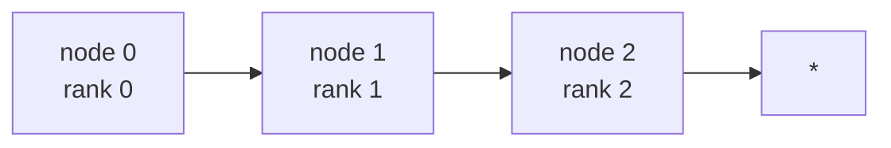

`*` continues the queue with exactly one node in each subsequent rank.

## binary-tree

Nodes use breadth-first order. Every node `i > 0` has parent `floor((i - 1) / 2)`, every parent has at most two children, and the final level may be partial. Implemented by `builders/binary-tree-scenario.ts`.

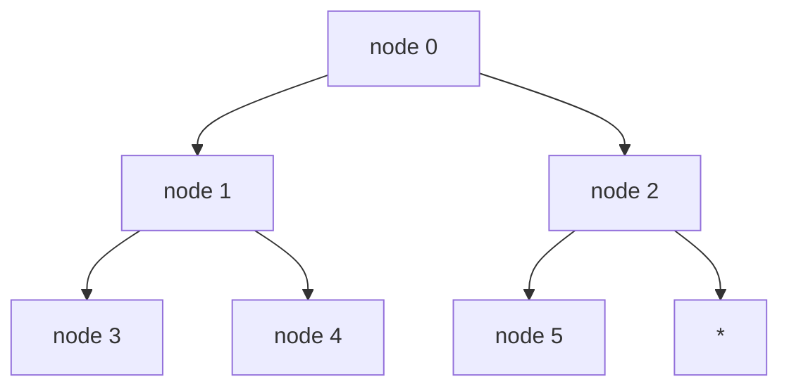

`*` denotes the optional continuation into a partial final level.

## unbalanced

Node `i` occupies append-only rank `floor(sqrt(i))`, giving complete rank widths `1, 3, 5, ...`. Every node after rank zero has one incoming edge. For each transition, the first source owns `ceil(0.8 * target rank width)` target edges; remaining targets are distributed over the other sources. Implemented by `builders/unbalanced-scenario.ts`.

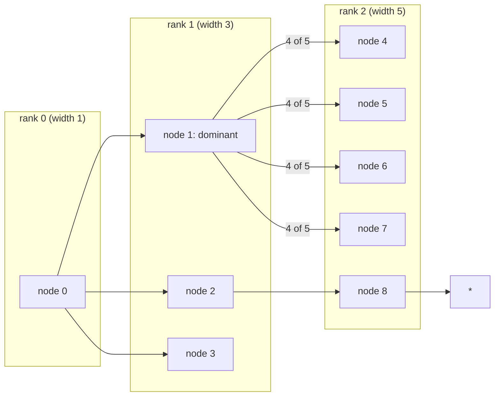

The `4 of 5` label illustrates the dominant source's 80% share. `*` continues with wider square-shell ranks; it does not add another edge to the illustrated rank transition.

## unbalanced-random

Ranks and edge density match `unbalanced`, but a local integer PRNG with exported fixed seed chooses the dominant source independently for each transition. Metadata records the selected owner IDs. `Math.random()` is never used. Implemented by `builders/unbalanced-random-scenario.ts`.

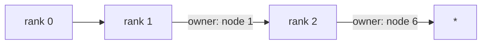

Rank 0 contains node 0, rank 1 contains nodes 1-3, and rank 2 contains nodes 4-8. The fixed seed selects node 1 to own 4 of the 5 edges into rank 2, then selects node 6 for the next transition. `*` continues the same seeded selection over wider ranks.

## subgroups

Node indices divisible by ten remain at root. All other nodes alternate between two top-level groups and use binary-tree edges. This leaves `ceil(0.1 * nodeCount)` root nodes and keeps either group at or below half of all requested nodes. Implemented by `builders/subgroups-scenario.ts`.

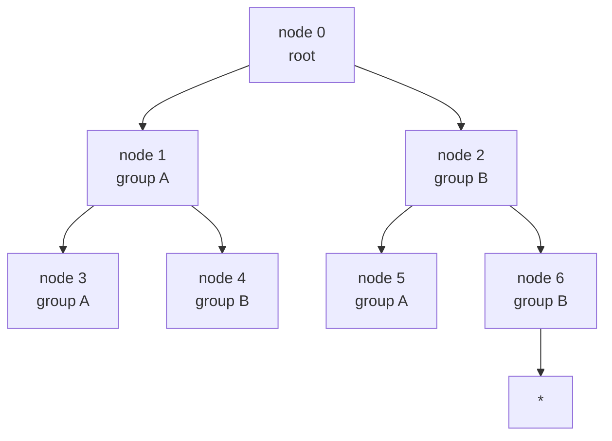

`*` continues the binary-tree edges. Non-multiples of ten keep alternating between groups A and B; nodes 10, 20, and later multiples of ten remain at the document root.

## nested-subgroups

Nodes use long-queue edges. Node `i` belongs directly to group `i`; group `i > 0` belongs to group `i - 1`. Containment depth therefore grows with node count. Implemented by `builders/nested-subgroups-scenario.ts`.

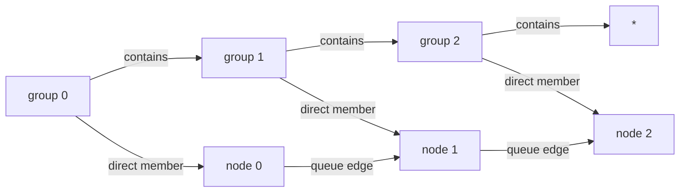

`*` continues both chains: each next group is nested in its predecessor, and its same-index node is a direct member connected by the long-queue edge.

## wide-bipartite-layers

Nodes use append-only square-shell ranks `floor(sqrt(i))`. Every source in rank `r` connects to every target in rank `r + 1`, producing dense adjacent-rank routing with near-`O(n^(3/2))` edge growth. Implemented by `builders/wide-bipartite-layers-scenario.ts`.

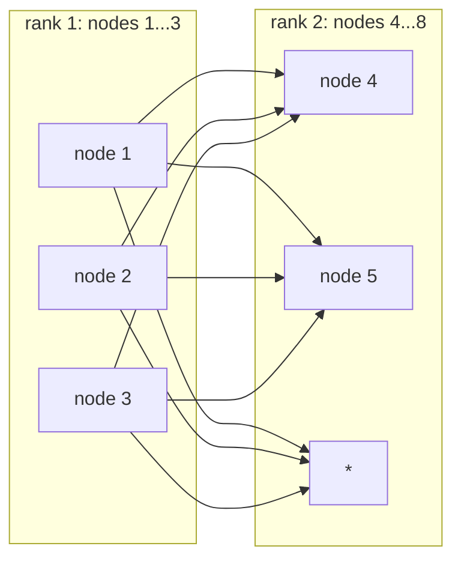

Within rank 2, `*` represents nodes 6-8. Each displayed source connects to every target represented in that rank; subsequent adjacent ranks follow the same complete bipartite rule.

## repeated-diamonds

Consecutive `source -> {left, right} -> merge` motifs share each merge as the next source. A final motif may be truncated to preserve the exact requested node count. Implemented by `builders/repeated-diamonds-scenario.ts`.

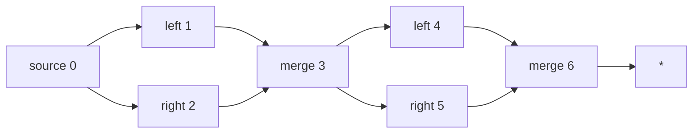

`*` starts the next fan-out/fan-in motif from merge node 6; the final motif may stop early at the requested node count.

## disconnected-components

Nodes are partitioned into deterministic two-node chains. An odd count leaves the final node isolated. Implemented by `builders/disconnected-components-scenario.ts`.

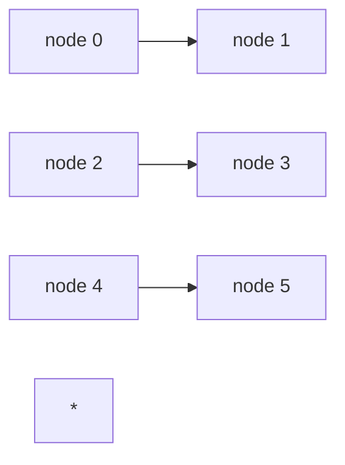

`*` denotes the final isolated node when the requested count is odd. Otherwise, every component is a two-node chain like those shown.

## junction-heavy

One XOR junction is inserted between every adjacent pair in a semantic-node chain. Relations alternate `node -> junction -> node`. Current production ranking increments on every edge, so junctions occupy odd ranks and semantic node `i` occupies graph rank `2 * i`; zero rank increment into junctions is a future production change. Implemented by `builders/junction-heavy-scenario.ts`.

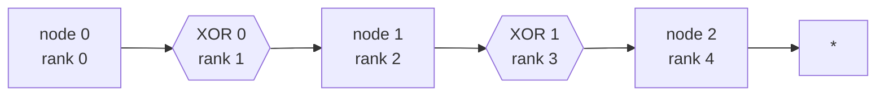

`*` continues the alternating node/XOR chain. The diagram shows current production behavior: both edges around each XOR advance rank. The future zero-increment rule for edges entering junctions is not depicted.

## group-relations

Node `i` belongs to sibling group `floor(sqrt(i))`, yielding prefix-stable group widths `1, 3, 5, ...`. One semantic relation connects each populated group to the next. Current production graph creation ranks those group endpoints directly and leaves their member nodes at rank zero; descendant Cartesian expansion is a future production change. Implemented by `builders/group-relations-scenario.ts`.

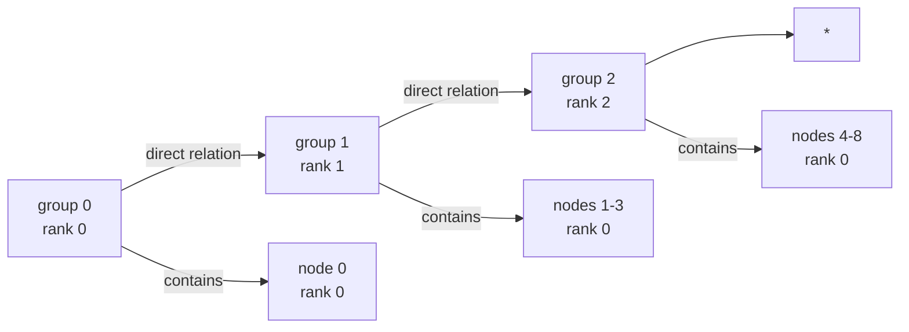

The group widths are 1, 3, 5, then 7, 9, and so on; `*` continues that sibling-group sequence. Only the direct group-to-group arrows exist in the current ranking graph. The containment arrows describe document membership, not ranking adjacency: all member nodes remain at rank zero. Member-to-member Cartesian edges are future production work and are intentionally not depicted.

## shallow-groups

Nodes use binary-tree edges. Indices divisible by ten stay at root; all other nodes enter append-only sibling groups containing at most nine direct nodes, with no nesting. This isolates group count and envelope scans from containment depth. Implemented by `builders/shallow-groups-scenario.ts`.

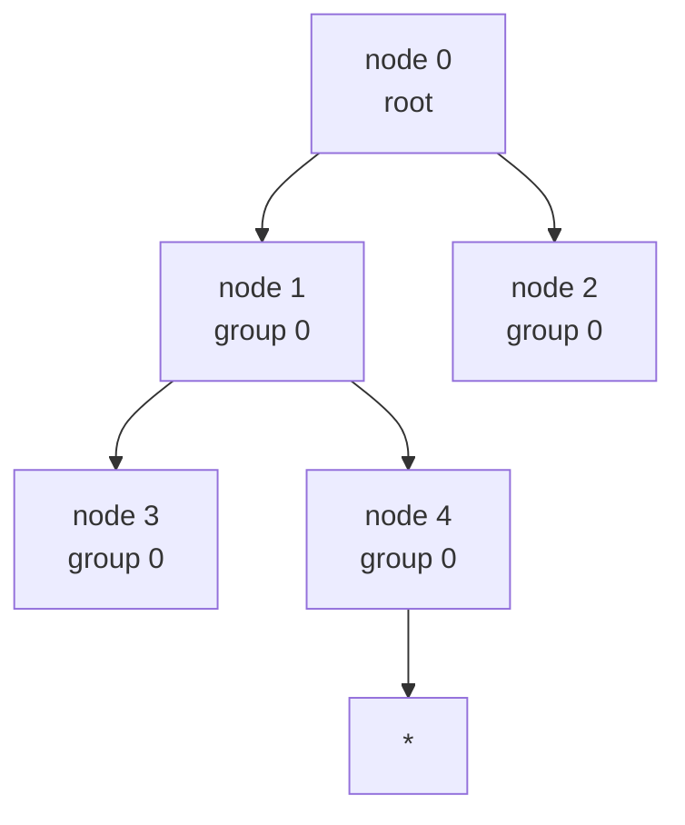

`*` continues the binary-tree edges. Node 10 remains at the document root, nodes 11-19 enter group 1, and later blocks follow the same pattern. Every group is a sibling with at most nine direct nodes; groups never nest.

## Governance

Changing a topology requires updating this README, its concrete builder, and its focused contract test together. Adding a topology requires a tuple member, one implementation, one catalog entry, one README heading, and focused assertions.
